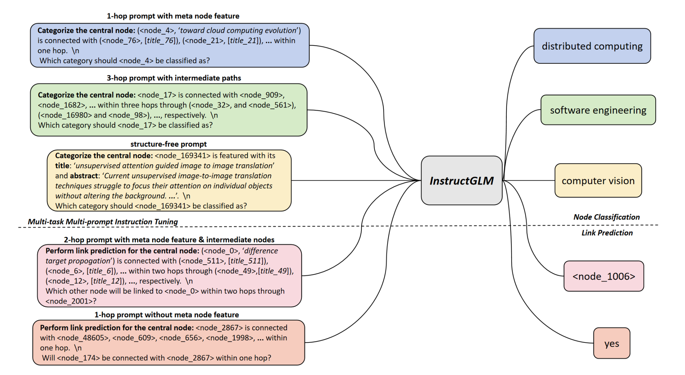

# Language is All a Graph Needs

This repo presents implementation of the **InstructGLM** (Instruction-finetuned Graph Language Model) and provide a natural language interface for graph machine learning:

>  **Paper**: Language is All a Graph Needs <br>

>  **Paper link**: [https://arxiv.org/abs/2308.07134](https://arxiv.org/abs/2308.07134)
  



  

## Introduction

We introduce our proposed **Instruct**ion-finetuned **G**raph **L**anguage **M**odel, i.e. **InstructGLM**, a framework utilizing natural language to describe both graph structure and node features to a generative large language model and further addresses graph-related problems by instruction-tuning, which provides a powerful natural language processing interface for graph machine learning.

## Usage

  

0. Clone this repo

  

```

git clone https://github.com/agiresearch/InstructGLM.git

```

  

1. Download preprocessed data from [Arxiv](https://drive.google.com/file/d/1xN4cnmSSrEdgn4xopsUEeQRRghaQ3B1B/view?usp=drive_link), [Cora](https://drive.google.com/file/d/1_8UtMA7P82HfYTDHZ0oPaxdDjueKNQfa/view?usp=drive_link), [PubMed](https://drive.google.com/file/d/1PHSp8Sx4LopNci4d0vZ8SCOWRBg4FhWc/view?usp=drive_link). If you would like to preprocess your own data, please follow the *data_preprocess* folder. Requiured raw data files for preprocessing can be downloaded from this [raw-Arxiv](https://drive.google.com/file/d/1pmWjrg195Rk-MHwrcaAhGGNcqCY-gEOc/view?usp=drive_link), [raw-Cora](https://drive.google.com/file/d/1V3sDFrXKS3VYSQp5netTaz4w3IgKQ7ac/view?usp=drive_link), [raw-PubMed](https://drive.google.com/file/d/1YbYZuuQunZybXzIc1f26y5aKLx-YIEDK/view?usp=drive_link).

  

2. Download Llama-7b pretrained checkpoint via this [Google Drive link](https://drive.google.com/file/d/1wLaPMSDAxCMcl3pJ-0bYymOid3gkULc3/view?usp=drive_link), it has been processed by the format conversion script of HuggingFace. Please then put the ./7B folder under the same path with ./scripts folder. 

  
  

3. Multi-task Multi-prompt Instruction Tuning

  

```

bash scripts/train_llama_arxiv.sh 8

```

Here *8* means using 8 GPUs to conduct parallel instruction tuning with DDP.

4. Validation/ Inference

```

bash scripts/test_llama_arxiv.sh 8

```
5. Main key points are summarized in note.txt
  
  

## Checkpoints

See: [Google Drive link](https://drive.google.com/file/d/1aNAx0gWpDyHlqYOUR17NomJNQJEMwprI/view?usp=drive_link).
 

## Citation

  

Please cite the following paper corresponding to the repository:

```

@article{ye2023language,
  title={Language is All a Graph Needs},
  author={Ye, Ruosong and Zhang, Caiqi and Wang, Runhui and Xu, Shuyuan and Zhang, Yongfeng},
  journal={EACL},
  year={2024}
}

```

  

## Acknowledgements

  

[TAPE](https://github.com/XiaoxinHe/TAPE), [GIANT](https://github.com/amzn/pecos/tree/mainline/examples/giant-xrt), [OGB](https://ogb.stanford.edu/docs/home/), [P5](https://github.com/jeykigung/P5), [OpenP5](https://github.com/agiresearch/OpenP5), and [Planetoid](https://arxiv.org/pdf/1603.08861.pdf)
